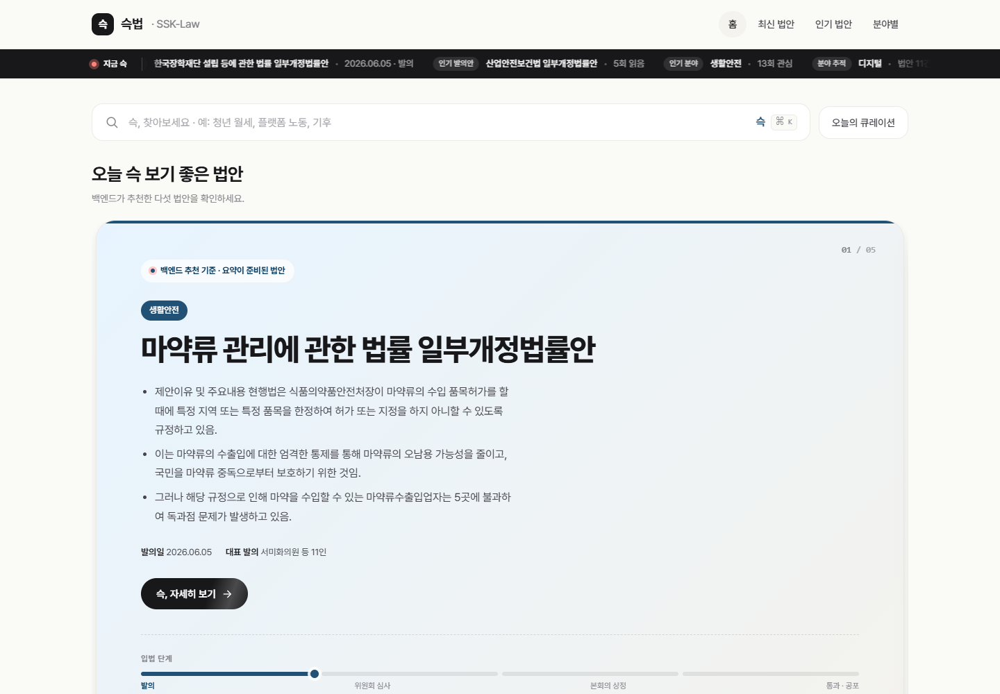
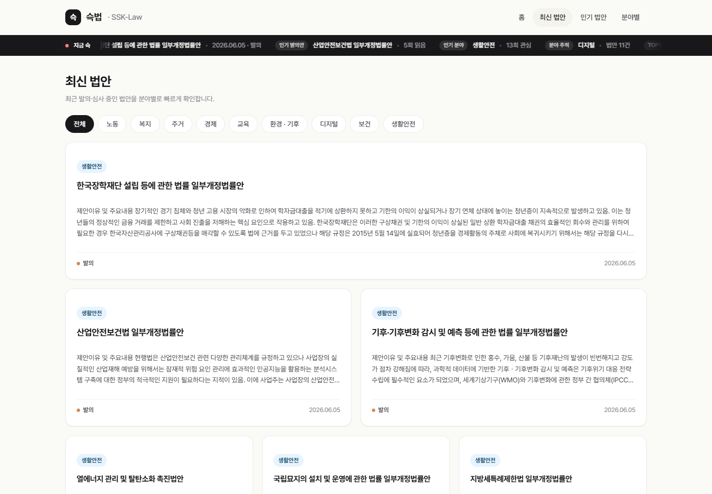
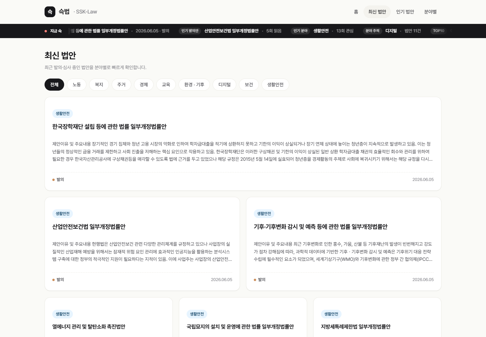
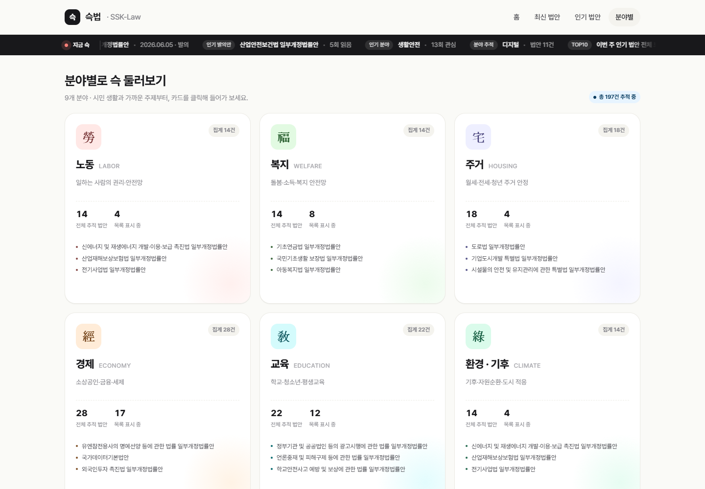
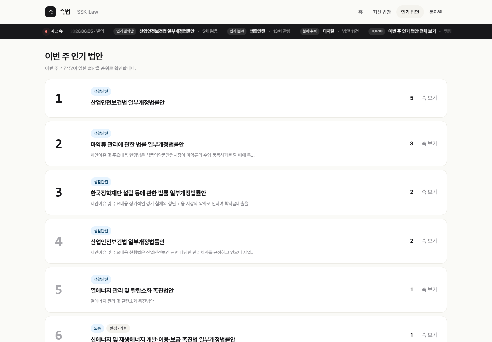
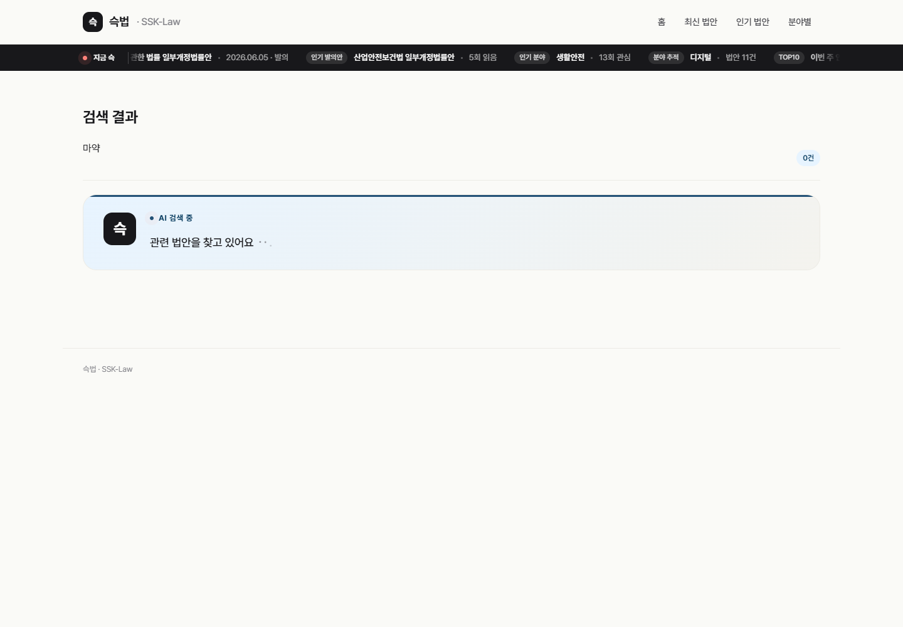

# SSK-Law

슥법(SSK-Law)은 최신 발의안과 법률 정보를 일반 사용자가 빠르게 이해할 수 있도록 요약, 태그, 자연어 검색을 제공하는 법률/법안 큐레이션 서비스입니다.

현재 저장소는 Phase 1 프로토타입을 기준으로 협업하기 위한 저장소입니다. 프론트엔드는 Vue/Vite, 백엔드는 Django API를 사용합니다.

## Project Structure

```text
.
├─ backend/
│  ├─ bills/
│  ├─ chat/
│  ├─ config/
│  └─ manage.py
├─ frontend/
│  ├─ src/
│  ├─ styles/
│  ├─ index.html
│  └─ package.json
├─ docs/
│  └─ screenshots/
├─ README.md
└─ .gitignore
```

`frontend/`는 Vue 기반 SPA이며 Vite 개발 서버에서 `/api` 요청을 Django 백엔드로 프록시합니다. 현재 라우팅은 hash route를 사용합니다.

## Run Locally

```bash
cd backend
.\venv\Scripts\python.exe manage.py runserver 127.0.0.1:8000 --noreload
```

다른 터미널에서 프론트 서버를 실행합니다.

```bash
cd frontend
npm install
npm run dev
```

브라우저에서 `http://127.0.0.1:5173`을 엽니다.

프로덕션 빌드 확인은 아래 명령으로 수행합니다.

```bash
cd frontend
npm run build
```

## Current Routes

| Route | Screen | Description |
|---|---|---|
| `#/` | Home | 검색 입력, 추천 법안 캐러셀 |
| `#/latest` | Latest Bills | 최신 법안 목록, 분야 필터 |
| `#/weekly` | Weekly Bills | 주간/인기 법안 |
| `#/search?q=` | Search Results | 자연어 검색 결과, 관련 법안 |
| Modal | Bill Detail | 법안 상세, 진행 단계, 요약, 유사 법안 영역 |

## Prototype Verification

검증일: 2026-06-09 KST

검증 환경:

- Backend: `http://127.0.0.1:8000`
- Frontend: `http://127.0.0.1:5173`
- Local DB: 실제 국회 API 동기화 데이터 기준

실행 확인:

| Check | Result |
|---|---|
| `npm run build` | 통과 |
| `python manage.py check` | 통과 |
| `GET /api/categories` | 200 OK |
| `GET /api/home/picks` | 200 OK |
| `GET /api/bills?sort=-proposed_at&page_size=10` | 200 OK, 전체 197건 기준 최신 목록 반환 |
| `GET /api/bills/2219102` | 200 OK, 요약 3줄과 원문 링크 반환 |
| 브라우저 콘솔 | error 0건 |

정상 동작 확인 기능:

- 홈 화면: 백엔드 추천 법안과 상단 ticker 표시
- 최신 법안 목록: 실제 API 법안 목록 렌더링, 요약 미생성 법안 fallback 표시
- 법안 상세 모달: 발의일, 대표 발의, 의안번호, 진행 단계, 요약, 원문 보기 표시
- 분야별 화면: 카테고리별 법안 진입 화면 표시
- 인기 법안 화면: 조회수 기반 랭킹 목록 표시

현재 제한:

- DB 파일은 Git에 포함하지 않습니다. 다른 개발자는 migration 후 국회 API sync와 요약 배치를 별도로 실행해야 합니다.
- 현재 로컬 DB 기준 전체 197건 중 요약 저장 법안은 일부만 존재합니다. 요약이 없는 법안은 `요약 준비 중입니다.`로 표시합니다.
- 자연어 AI 검색은 요청 UI까지 동작하지만 Ollama 응답 시간이 길어 검증 시점에는 완료 응답을 정상 기능으로 확정하지 않았습니다.

### Screenshots

#### Home



#### Latest Bills



#### Bill Detail Modal



#### Categories



#### Weekly Ranking



#### AI Search Request State



## Collaboration Rules

### Branches

`main`은 항상 실행 가능한 상태를 유지합니다. 직접 push하지 않고 PR을 통해 병합합니다.

브랜치 이름은 아래 규칙을 사용합니다.

```text
feat/<scope>-<short-name>
fix/<scope>-<short-name>
docs/<scope>-<short-name>
refactor/<scope>-<short-name>
test/<scope>-<short-name>
```

예시:

```text
feat/search-result-page
fix/card-layout-mobile
docs/wbs-update
```

### Commits

커밋 메시지는 Conventional Commits 형식을 사용합니다.

```text
feat: add latest bill filters
fix: prevent modal scroll bleed
docs: add git collaboration rules
refactor: split search rendering logic
test: add search fallback cases
```

커밋은 가능한 한 작은 단위로 나눕니다. 서로 다른 목적의 변경을 한 커밋에 섞지 않습니다.

### Pull Requests

PR에는 아래 내용을 포함합니다.

```text
## Summary
- 변경 요약

## Test
- 확인한 실행/테스트 방법

## WBS
- 연결된 Notion WBS 항목

## Screenshots
- UI 변경이 있으면 전/후 화면
```

PR 크기는 리뷰 가능한 범위로 유지합니다. 큰 기능은 화면, API 연동, 상태 처리처럼 나눠서 올립니다.

### Review Rules

- 최소 1명 이상 리뷰 후 병합합니다.
- 리뷰는 버그, 요구사항 누락, UI 깨짐, 데이터 계약 불일치를 우선 확인합니다.
- 스타일 취향만으로 큰 수정 요청을 하지 않습니다. 근거가 있는 경우에만 변경을 요청합니다.
- 충돌이 생기면 작업자가 rebase 또는 merge로 직접 해결합니다.

### WBS Sync

작업을 시작하기 전에 Notion WBS 항목을 확인합니다.

- 작업 시작: WBS 상태를 `진행중`으로 변경
- PR 생성: PR 링크를 WBS 노트에 기록
- 병합 후: WBS 상태를 `완료`로 변경

### File and Folder Naming

- 폴더명은 소문자 kebab-case 또는 단일 명사형을 사용합니다.
- 공백, 괄호, 임시 이름을 사용하지 않습니다.
- 프론트 앱 루트는 `frontend/`로 고정합니다.
- 검증용 임시 산출물은 `output/`에 두고 Git에는 올리지 않습니다.
- README에 첨부할 문서용 스크린샷은 `docs/screenshots/`에 저장합니다.

## Phase Notes

Phase 1은 Auth 없이 동작하는 MVP를 목표로 합니다.

- 저장/기록은 `anonymous_session_id` 또는 localStorage 기반으로 처리합니다.
- Auth, 로그인, 사용자 설정은 Stretch로 분리합니다.
- W3까지 Phase 1 데모가 중단 없이 동작해야 합니다.

Phase 2 이후에는 Zero-shot baseline과 Fine-tuning 결과를 같은 평가셋으로 비교합니다.

Phase 3에서는 유사 발의안 검색과 조문 기반 검색의 RAG 성능을 별도 지표로 측정합니다.
