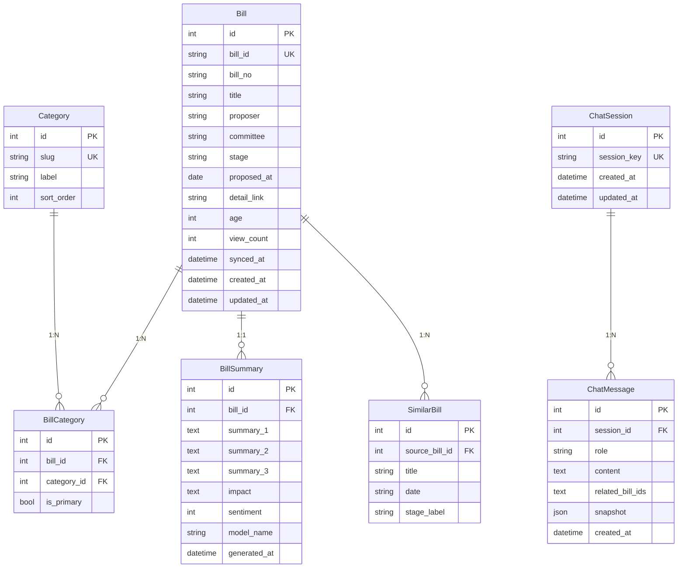

# 슥법 (SSK-Law) — 데이터베이스 명세서

> **버전**: v1.1-MVP  
> **최종 수정**: 2026-05-27  
> **대상 DB**: SQLite (개발) / PostgreSQL (운영)

---

## 목차

1. [개요](#1-개요)
2. [ER 다이어그램](#2-er-다이어그램)
3. [테이블 정의](#3-테이블-정의)
4. [인덱스 전략](#4-인덱스-전략)
5. [데이터 흐름](#5-데이터-흐름)

---

## 1. 개요

MVP 단계에서 구현하는 핵심 기능은 두 가지입니다.

| 기능 | 설명 |
|------|------|
| **국회 법률발의안 수집 · AI 요약** | 열린국회정보 API 및 법사위/본회의 API에서 법률안을 주기적으로 수집하고, DB에 누락된 상위 법안을 신규 적재한 뒤 AI(Ollama)로 시민 친화 3줄 요약·예상 영향을 생성 |
| **AI 챗봇 (자연어 검색)** | 사용자의 자연어 질문을 AI에게 전달하여 관련 법안을 검색하고 친근한 답변 생성 및 대화 이력 스냅샷 영속화 |

> **제외 항목**: 로그인, 회원 관리, 세션, 북마크 저장, 사용자 프로필 등은 Phase 2 이후로 분리합니다.

---

## 2. ER 다이어그램



---

## 3. 테이블 정의

### 3.1 `category` — 법안 분야

| 컬럼 | 타입 | 제약 | 설명 |
|------|------|------|------|
| `id` | `INTEGER` | PK, AUTO | 내부 ID |
| `slug` | `VARCHAR(30)` | UNIQUE, NOT NULL | URL-safe 식별자 (예: `labor`, `housing`) |
| `label` | `VARCHAR(30)` | NOT NULL | 화면 표시명 (예: `노동`, `주거`) |
| `sort_order` | `INTEGER` | DEFAULT 0 | 정렬 순서 |

**초기 데이터** (프론트엔드 `data.js` 기준):

| slug | label |
|------|-------|
| `labor` | 노동 |
| `welfare` | 복지 |
| `housing` | 주거 |
| `economy` | 경제 |
| `education` | 교육 |
| `env` | 환경 · 기후 |
| `digital` | 디지털 |
| `health` | 보건 |
| `safety` | 생활안전 |

---

### 3.2 `bill` — 법률 발의안

국회 열린국회정보 API 응답을 정규화하여 저장합니다.

| 컬럼 | 타입 | 제약 | 설명 |
|------|------|------|------|
| `id` | `INTEGER` | PK, AUTO | 내부 ID |
| `bill_id` | `VARCHAR(50)` | UNIQUE, NOT NULL | 국회 API BILL_ID (예: `PRC_Z2Z1Z0Z3...`) |
| `bill_no` | `VARCHAR(20)` | NOT NULL | 의안번호 (예: `2113663`) |
| `title` | `VARCHAR(500)` | NOT NULL | 법률안명 (`BILL_NAME`) |
| `proposer` | `VARCHAR(200)` | NOT NULL | 대표발의 (`PROPOSER`, 예: `김○○ 의원 외 12인`) |
| `committee` | `VARCHAR(100)` | NULL | 소관 위원회 (`COMMITTEE`) |
| `stage` | `VARCHAR(20)` | NOT NULL, DEFAULT `'proposed'` | 진행 단계 (`proposed` / `committee` / `plenary` / `passed`) |
| `proposed_at` | `DATE` | NOT NULL | 제안일 (`PROPOSE_DT`) |
| `detail_link` | `URLField(500)` | NULL | 의안 상세 URL (`DETAIL_LINK`) |
| `age` | `INTEGER` | NOT NULL | 국회 대수 (예: `22`) |
| `view_count` | `INTEGER` | DEFAULT 0 | 서비스 내 조회수 |
| `synced_at` | `DATETIME` | NULL | 마지막 국회 API 동기화 시각 |
| `created_at` | `DATETIME` | AUTO | 레코드 생성 시각 |
| `updated_at` | `DATETIME` | AUTO | 레코드 수정 시각 |

**`stage` 매핑 규칙** (국회 API `PROC_RESULT` → 내부 stage):

| PROC_RESULT 키워드 | stage |
|-------------------|-------|
| 접수, 발의, 제안 | `proposed` |
| 위원회, 심사, 상정 | `committee` |
| 본회의 | `plenary` |
| 가결, 수정가결, 원안가결, 공포, 통과 | `passed` |

---

### 3.3 `bill_category` — 법안-분야 매핑 (M:N)

| 컬럼 | 타입 | 제약 | 설명 |
|------|------|------|------|
| `id` | `INTEGER` | PK, AUTO | 내부 ID |
| `bill_id` | `INTEGER` | FK → `bill.id`, NOT NULL | 법안 참조 |
| `category_id` | `INTEGER` | FK → `category.id`, NOT NULL | 분야 참조 |
| `is_primary` | `BOOLEAN` | DEFAULT `false` | 대표 분야 여부 (프론트엔드 `accent` 태그) |

**UNIQUE 제약**: `(bill_id, category_id)`

---

### 3.4 `bill_summary` — AI 생성 요약

| 컬럼 | 타입 | 제약 | 설명 |
|------|------|------|------|
| `id` | `INTEGER` | PK, AUTO | 내부 ID |
| `bill_id` | `INTEGER` | FK → `bill.id`, UNIQUE, NOT NULL | 법안 참조 (1:1) |
| `summary_1` | `TEXT` | NOT NULL | 첫 번째 요약 문장 |
| `summary_2` | `TEXT` | NULL | 두 번째 요약 문장 |
| `summary_3` | `TEXT` | NULL | 세 번째 요약 문장 |
| `impact` | `TEXT` | NULL | 예상 영향 (AI 생성) |
| `sentiment` | `INTEGER` | DEFAULT 0 | 긍정 지표 (0–100, AI 추정) |
| `model_name` | `VARCHAR(100)` | NULL | 요약 생성에 사용된 모델명 |
| `generated_at` | `DATETIME` | AUTO | 요약 생성 시각 |

---

### 3.5 `similar_bill` — 유사 법안

| 컬럼 | 타입 | 제약 | 설명 |
|------|------|------|------|
| `id` | `INTEGER` | PK, AUTO | 내부 ID |
| `source_bill_id` | `INTEGER` | FK → `bill.id`, NOT NULL | 기준 법안 |
| `title` | `VARCHAR(500)` | NOT NULL | 유사 법안 제목 |
| `date` | `VARCHAR(20)` | NULL | 유사 법안 발의일 |
| `stage_label` | `VARCHAR(30)` | NULL | 유사 법안 단계 표시 (한글, 예: `위원회`) |

---

### 3.6 `chat_session` — 챗봇 대화 세션

> 로그인 없이 `anonymous_session_id` 방식으로 운영합니다.

| 컬럼 | 타입 | 제약 | 설명 |
|------|------|------|------|
| `id` | `INTEGER` | PK, AUTO | 내부 ID |
| `session_key` | `VARCHAR(64)` | UNIQUE, NOT NULL | 클라이언트에서 생성한 UUID |
| `created_at` | `DATETIME` | AUTO | 세션 시작 시각 |
| `updated_at` | `DATETIME` | AUTO | 마지막 메시지 시각 |

---

### 3.7 `chat_message` — 챗봇 메시지

| 컬럼 | 타입 | 제약 | 설명 |
|------|------|------|------|
| `id` | `INTEGER` | PK, AUTO | 내부 ID |
| `session_id` | `INTEGER` | FK → `chat_session.id`, NOT NULL | 세션 참조 |
| `role` | `VARCHAR(10)` | NOT NULL | 발신자 (`user` / `assistant`) |
| `content` | `TEXT` | NOT NULL | 메시지 본문 |
| `related_bill_ids` | `TEXT` | NULL | 관련 법안 ID 목록 (JSON array string, 예: `["b1","b3"]`) |
| `snapshot` | `JSON` | NULL | 질문 구조화 분석 결과 (summary, issue, keywords, risk_level) |
| `created_at` | `DATETIME` | AUTO | 전송 시각 |

---

## 4. 인덱스 전략

| 테이블 | 인덱스 | 타입 | 목적 |
|--------|--------|------|------|
| `bill` | `idx_bill_bill_id` | UNIQUE | 국회 API ID 조회 |
| `bill` | `idx_bill_proposed_at` | B-Tree | 최신순 정렬 |
| `bill` | `idx_bill_stage` | B-Tree | 단계별 필터 |
| `bill` | `idx_bill_age` | B-Tree | 대수별 필터 |
| `bill_category` | `idx_bc_bill_category` | UNIQUE | 중복 방지 |
| `bill_category` | `idx_bc_category` | B-Tree | 분야별 법안 조회 |
| `bill_summary` | `idx_bs_bill` | UNIQUE | 법안별 요약 1:1 조회 |
| `similar_bill` | `idx_sb_source` | B-Tree | 기준 법안의 유사 법안 조회 |
| `chat_session` | `idx_cs_key` | UNIQUE | 세션 키 조회 |
| `chat_message` | `idx_cm_session` | B-Tree | 세션별 메시지 시간순 조회 |

---

## 5. 데이터 흐름

### 5.1 법안 수집 · 요약 파이프라인

```
[국회 OpenAPI]
일반 발의안 API (nzmimeepazxkubdpn)
법사위 처리 API (TVBPMBILL11)
본회의 처리 API (nwbpacrgavhjryiph)
                 │
                 ├───GET───► [Django Command (sync_and_process_100_bills)]
                                         │
                 ┌───────────────────────┴───────────────────────┐
                 ▼                                               ▼
       [기존 DB에 법안 존재함]                          [DB에 법안 존재하지 않음]
                 │                                               │
                 ▼                                               ▼
      기존 법안 단계 전진 및 업데이트                    상위 법안 신규 객체(Bill) 생성
    (proposed->committee->plenary->passed)               (소관위 매핑 폴백 카테고리 저장)
                 │                                               │
                 └───────────────────────┬───────────────────────┘
                                         ▼
                             BPMBILLSUMMARY 상세 API 조회
                                         │
                                         ▼
                            Ollama API 요약 및 분류 요청
                                         │
                 ┌───────────────────────┴───────────────────────┐
                 ▼                                               ▼
       [AI 요약 & 카테고리 분류 성공]                     [AI 요약 실패 / 카테고리 누락]
                 │                                               │
                 ▼                                               ▼
     update_or_create 요약 생성/갱신                     소관위원회(committee) 분석
     (3줄 요약, 영향, LLM 분류 카테고리)                 기반 폴백(fallback) 카테고리 도출
                 │                                               │
                 └───────────────────────┬───────────────────────┘
                                         ▼
                               BillCategory 매핑 확정
```

> **상세 분류 및 상위 법안 연동 매커니즘**:
> 1. **다단계 수집 및 자동 신규 적재**: 국회 일반 발의안뿐만 아니라 법사위, 본회의 API를 병렬 동기화합니다. 기존 데이터베이스에 해당 의안 번호가 없는 상위 법안은 백엔드에서 신규 `Bill` 객체로 즉시 Insert하여 누락 없는 아카이빙을 보장합니다.
> 2. **상세 요약 데이터 결합**: 동기화된 모든 신규/미요약 법안의 상세 본문/제안이유 수집을 위해 `BPMBILLSUMMARY` API를 추가 조회합니다.
> 3. **AI 요약 생성 및 예외 관리**: `ollama.summarize_bill`을 통해 AI 요약 정보를 요청합니다. 저장 시 `update_or_create`를 사용하여 동시 호출이나 기존 데이터 존재 시 발생할 수 있는 UNIQUE 충돌(`IntegrityError`)을 예외 처리하고 안전하게 영속화합니다.
> 4. **폴백 카테고리 도출**: AI 요약 프로세스가 실패하거나 결과 내에 유효한 카테고리 대분류 슬러그가 누락된 경우, 소관위원회 매핑 폴백 함수(`_map_categories`)를 구동해 카테고리 분류 정보의 일관성을 채워 넣습니다.

### 5.2 AI 챗봇 흐름

```
사용자 질문 ──POST /api/chat──► ChatSession 조회/생성
                                     │
                                     ▼
                              ChatMessage(role=user) 저장
                                     │
                                     ▼
                              법안 DB 컨텍스트 조합 + Ollama 호출
                                     │
                                     ▼
                              ChatMessage(role=assistant) 저장
                                     │
                                     ▼
                              JSON 응답 반환
```

---

## Django Model 참고 매핑

| 테이블 | Django App | Model 클래스 |
|--------|-----------|-------------|
| `category` | `bills` | `Category` |
| `bill` | `bills` | `Bill` |
| `bill_category` | `bills` | `BillCategory` |
| `bill_summary` | `bills` | `BillSummary` |
| `similar_bill` | `bills` | `SimilarBill` |
| `chat_session` | `chat` | `ChatSession` |
| `chat_message` | `chat` | `ChatMessage` |
